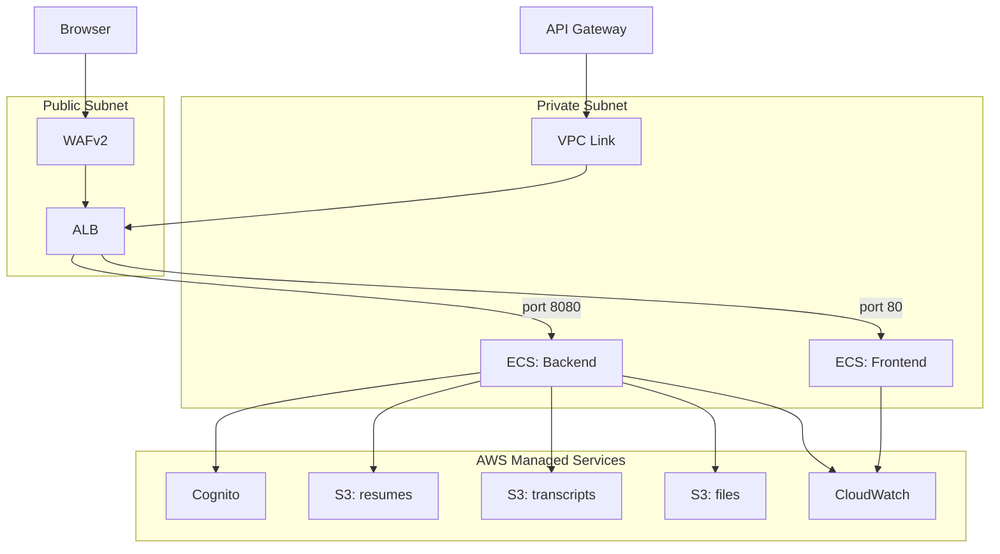

# Deployment

## Section 1: AWS Architecture

### Architecture Diagram



### Infrastructure Summary

A request from a user's browser first reaches the **WAFv2 Web ACL**, which evaluates it against the AWS Managed Common Rule Set before allowing it to pass. If allowed, the request hits the **Application Load Balancer** in the public subnet. The ALB routes based on port: port 80 traffic is forwarded to the frontend target group, and port 8080 traffic is forwarded to the backend target group. Both target groups point to **ECS Fargate** tasks running in the private subnets — the frontend serving the React SPA on port 3000 and the backend serving the FastAPI application on port 8000.

API calls that originate from the browser can also enter via the **API Gateway HTTP API**, which matches any request on `ANY /api/{proxy+}` and forwards it through a **VPC Link** into the private subnet, where it hits the ALB's backend listener on port 8080 and is routed to the backend ECS service.

The backend task communicates outward to three AWS-managed services: **AWS Cognito** for token validation and user pool operations, and three private **S3 buckets** (resumes, transcripts, and general files) for document storage and retrieval via presigned URLs. Both ECS services ship their stdout/stderr logs to **CloudWatch Log Groups** with 14-day retention. Two CloudWatch alarms monitor health: one fires if backend CPU exceeds 80%, another if the ALB returns more than 10 five-hundred errors in a 60-second window.

The database is not provisioned by this Terraform — it is supplied externally via the `DATABASE_URL` variable (see Section 2.4).

---

## Section 2: Staging Environment Guide

This guide is for teams who are taking over a deployed staging environment. The infrastructure already exists — you are not deploying from scratch.

### 2.1 What the Staging Environment Is

The staging environment is a fully containerized deployment of the NExT Applicant Tracking System running on AWS. It consists of:

- Two **ECS Fargate** services (frontend and backend) running in private subnets behind an Application Load Balancer
- **AWS Cognito** managing all user authentication and authorization, including the hosted sign-in UI
- Three private **S3 buckets** storing candidate resumes, transcripts, and general application files
- A **PostgreSQL database** connected via `DATABASE_URL` (provisioned outside this Terraform — see Section 2.4)
- **CloudWatch** collecting logs from both ECS services and monitoring CPU and error rate

See the architecture diagram above for the full topology.

### 2.2 AWS Access

The infrastructure is deployed to **`us-east-1`** (default; confirm with `terraform output` or the AWS console if the environment was deployed with a different `aws_region` value).

To work with the deployed resources, the following IAM permissions are needed:

- **ECS**: `ecs:DescribeServices`, `ecs:DescribeTasks`, `ecs:UpdateService`, `ecs:RegisterTaskDefinition`
- **ECR**: `ecr:GetAuthorizationToken`, `ecr:BatchGetImage`, `ecr:PutImage` (for pushing new images)
- **CloudWatch Logs**: `logs:GetLogEvents`, `logs:FilterLogEvents`, `logs:DescribeLogGroups`
- **S3**: `s3:ListBucket`, `s3:GetObject` on the three application buckets (for inspection)
- **Cognito**: `cognito-idp:AdminCreateUser`, `cognito-idp:AdminAddUserToGroup` (for creating admin accounts)
- **Terraform**: the permissions above plus `iam:*`, `ec2:*`, `elasticloadbalancing:*`, `wafv2:*`, `apigateway:*` to apply infrastructure changes

> **TODO:** How to request AWS credentials or access to this account — fill in before handoff.

> **TODO:** Confirm whether access is via IAM user with access keys, IAM role assumption (e.g., `aws sts assume-role`), or AWS SSO (`aws sso login`).

### 2.3 Cognito Access

Cognito is configured as follows, based on the Terraform:

- **User pool**: created with email auto-verification (confirmation via clickable link, not code), case-insensitive usernames, and password requirements of minimum 12 characters with uppercase, lowercase, numbers, and symbols
- **App client**: uses the OAuth2 Authorization Code flow (`response_type=code`) with scopes `email`, `openid`, `profile`. Token validity: access and ID tokens expire after 1 hour; refresh tokens expire after 30 days
- **Hosted UI**: Cognito provides a hosted login page at `{domain}.auth.us-east-1.amazoncognito.com`. The domain prefix is `application-tracker-dev-auth-{random-suffix}` — the exact domain is available as a Terraform output (`cognito_hosted_ui_domain`)
- **ADMIN group**: a Cognito group named `ADMIN` (configurable via `cognito_admin_group_name`) controls admin access. Users in this group gain admin privileges in the application
- **Callback URLs**: currently defaulted to `http://localhost:3000/login` — must be updated for the staging domain

The full Hosted UI login URL is available as the `cognito_hosted_ui_login_url` Terraform output.

> **TODO:** Document how a new team member gets their first ADMIN account created. The `/api/auth/admin/create-admin` endpoint requires an existing ADMIN-role bearer token, so the very first admin must be created directly in the Cognito console or via AWS CLI: `aws cognito-idp admin-create-user` followed by `aws cognito-idp admin-add-user-to-group --group-name ADMIN`.

> **TODO:** Update `cognito_callback_urls` and `cognito_logout_urls` in Terraform variables to the actual staging frontend URL before handoff. Currently defaults to `http://localhost:3000/login`.

### 2.4 Working with the Infrastructure

**Viewing ECS services and logs**

```bash
# List services in the cluster
aws ecs list-services --cluster application-tracker-${ENVIRONMENT}-cluster --region us-east-1

# Describe a service (shows running count, task definition, events)
aws ecs describe-services \
  --cluster application-tracker-${ENVIRONMENT}-cluster \
  --services application-tracker-${ENVIRONMENT}-backend \
  --region us-east-1

# Tail backend logs (replace LOG_STREAM with an actual stream name)
aws logs tail /ecs/application-tracker-${ENVIRONMENT}/backend --follow --region us-east-1

# Tail frontend logs
aws logs tail /ecs/application-tracker-${ENVIRONMENT}/frontend --follow --region us-east-1
```

**Connecting to the database**

The RDS or PostgreSQL instance is not provisioned by this Terraform — it is supplied externally via the `DATABASE_URL` variable passed into the backend ECS task. The database host lives outside the VPC as configured, or was provisioned manually.

The ECS backend task is in a private subnet with no public IP. To connect to the database directly (e.g., for migrations or inspection), you need a bastion host or an AWS Systems Manager Session Manager tunnel into the private subnet.

> **TODO:** Document whether a bastion host or SSM Session Manager is available for private subnet access. If neither exists, one must be provisioned before direct database access is possible.

> **TODO:** Document the database host, port, and credentials (or how to retrieve them from AWS Secrets Manager / Parameter Store if stored there).

**Inspecting S3 buckets**

Bucket names follow the pattern `application-tracker-{environment}-{purpose}-{account-id}-us-east-1`. Exact names are available as Terraform outputs:

```bash
terraform output s3_bucket_resumes
terraform output s3_bucket_transcripts
terraform output s3_bucket_files

# List objects in a bucket
aws s3 ls s3://$(terraform output -raw s3_bucket_resumes)/candidate-resumes/ --region us-east-1
```

All buckets have public access blocked. Objects are accessed via presigned URLs generated by the backend.

**Terraform state**

No remote backend is configured in `main.tf` — Terraform state is stored in a local `terraform.tfstate` file in `/infrastructure/terraform/`. This means:

- Whoever last ran `terraform apply` holds the authoritative state file
- There is no locking — concurrent applies from different machines will corrupt state

> **TODO:** Before team handoff, migrate state to a remote backend (S3 + DynamoDB lock table is the standard AWS approach). Add a `terraform { backend "s3" { ... } }` block to `main.tf` and run `terraform init -migrate-state`. Coordinate with the current state file holder to transfer the file if a remote backend is not yet set up.

### 2.5 Deploying Changes

There is no CI/CD pipeline — no `.github/workflows/` directory exists in this repository. All deployments are currently manual.

**Full deployment sequence:**

**Step 1 — Build and push container images to ECR**

```bash
# Set your variables
AWS_ACCOUNT_ID=<your-account-id>
AWS_REGION=us-east-1
ENVIRONMENT=dev   # or staging/prod

# Authenticate Docker to ECR
aws ecr get-login-password --region $AWS_REGION | \
  docker login --username AWS --password-stdin \
  $AWS_ACCOUNT_ID.dkr.ecr.$AWS_REGION.amazonaws.com

# Build and push backend
docker build -t application-tracker-backend ./backend
docker tag application-tracker-backend:latest \
  $AWS_ACCOUNT_ID.dkr.ecr.$AWS_REGION.amazonaws.com/application-tracker-backend:latest
docker push $AWS_ACCOUNT_ID.dkr.ecr.$AWS_REGION.amazonaws.com/application-tracker-backend:latest

# Build and push frontend
docker build -t application-tracker-frontend ./frontend
docker tag application-tracker-frontend:latest \
  $AWS_ACCOUNT_ID.dkr.ecr.$AWS_REGION.amazonaws.com/application-tracker-frontend:latest
docker push $AWS_ACCOUNT_ID.dkr.ecr.$AWS_REGION.amazonaws.com/application-tracker-frontend:latest
```

> **TODO:** ECR repositories are not defined in the Terraform in this repo. Confirm whether they were created manually or via a separate process, and document the exact repository URIs before handoff.

**Step 2 — Apply Terraform changes (infrastructure changes only)**

```bash
cd infrastructure/terraform

terraform init
terraform plan \
  -var="environment=$ENVIRONMENT" \
  -var="backend_image=$AWS_ACCOUNT_ID.dkr.ecr.$AWS_REGION.amazonaws.com/application-tracker-backend:latest" \
  -var="frontend_image=$AWS_ACCOUNT_ID.dkr.ecr.$AWS_REGION.amazonaws.com/application-tracker-frontend:latest" \
  -var="database_url=<your-database-url>"

terraform apply   # review plan output before confirming
```

**Step 3 — Force ECS to pull the new image (code changes only)**

If only the container image changed and no Terraform variables changed, force a new ECS deployment instead of re-running Terraform:

```bash
# Force new deployment for backend
aws ecs update-service \
  --cluster application-tracker-${ENVIRONMENT}-cluster \
  --service application-tracker-${ENVIRONMENT}-backend \
  --force-new-deployment \
  --region $AWS_REGION

# Force new deployment for frontend
aws ecs update-service \
  --cluster application-tracker-${ENVIRONMENT}-cluster \
  --service application-tracker-${ENVIRONMENT}-frontend \
  --force-new-deployment \
  --region $AWS_REGION
```

**Step 4 — Run database migrations (after backend deploy)**

Migrations must be run from within the private subnet. Until a bastion or tunnel is available (see Section 2.4), this can be done by exec-ing into the running backend ECS task:

```bash
# Find the running task ARN
TASK_ARN=$(aws ecs list-tasks \
  --cluster application-tracker-${ENVIRONMENT}-cluster \
  --service-name application-tracker-${ENVIRONMENT}-backend \
  --region $AWS_REGION \
  --query 'taskArns[0]' --output text)

# Exec into the container (requires ECS Exec to be enabled on the service)
aws ecs execute-command \
  --cluster application-tracker-${ENVIRONMENT}-cluster \
  --task $TASK_ARN \
  --container backend \
  --interactive \
  --command "alembic upgrade head"
```

> **TODO:** ECS Exec (`execute-command`) is not currently enabled on the ECS service definitions in Terraform (`enable_execute_command = true` must be added to `aws_ecs_service` resources). Enable this before handoff or document an alternative migration path.
