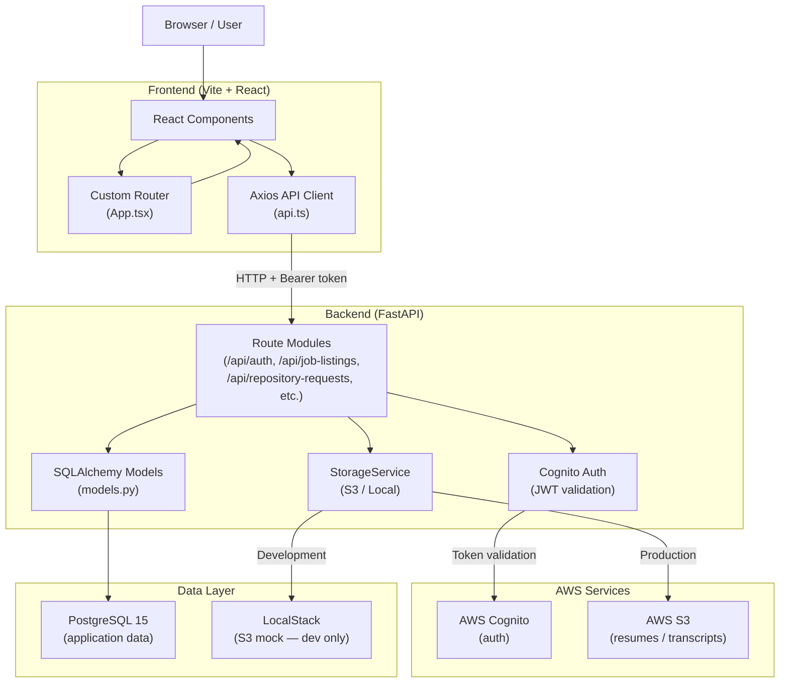
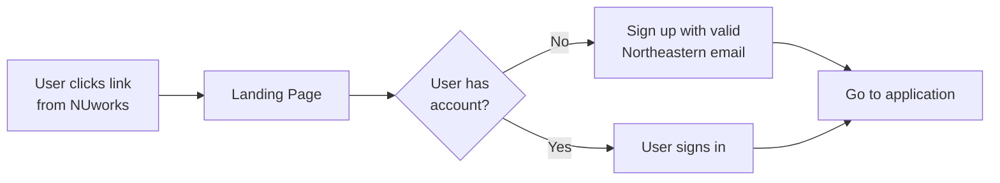
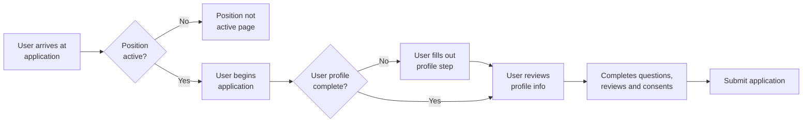
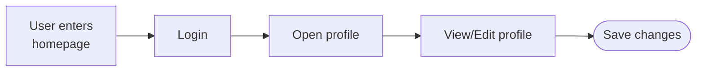
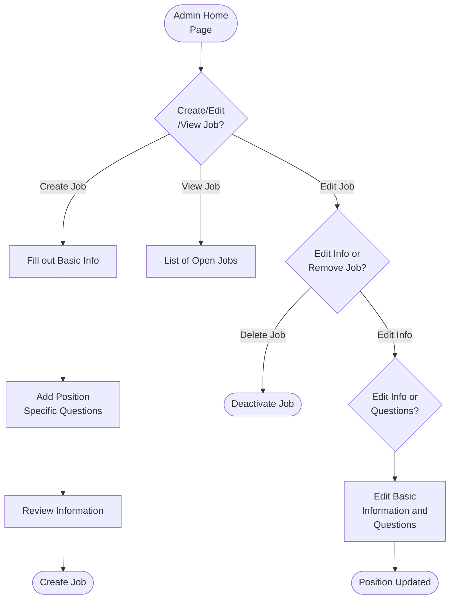
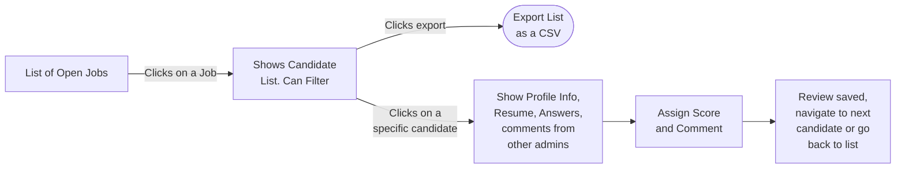

# System Architecture

## Tech Stack

| Technology                         | Category       | Version           |
| ---------------------------------- | -------------- | ----------------- |
| React                              | Frontend       | ^18.3.1           |
| TypeScript                         | Frontend       | ^5.6.2            |
| Vite                               | Frontend       | ^5.4.8            |
| Tailwind CSS                       | Frontend       | ^4.2.1            |
| Axios                              | Frontend       | ^1.11.0           |
| radix-ui (core)                    | Frontend       | ^1.4.3            |
| Lucide React                       | Frontend       | ^0.575.0          |
| shadcn (CLI)                       | Frontend       | ^3.8.5            |
| tailwind-merge                     | Frontend       | ^3.5.0            |
| FastAPI                            | Backend        | >=0.115.0         |
| Uvicorn                            | Backend        | >=0.30.0          |
| SQLAlchemy                         | Backend        | >=2.0.0           |
| Alembic                            | Backend        | >=1.13.0          |
| psycopg2-binary                    | Backend        | >=2.9.0           |
| Pydantic Settings                  | Backend        | >=2.4.0           |
| Boto3 (AWS SDK)                    | Backend        | >=1.35.0          |
| python-multipart                   | Backend        | >=0.0.9           |
| Faker                              | Backend        | >=24.0.0          |
| Terraform                          | Infrastructure | >=1.5.0           |
| AWS Provider (hashicorp/aws)       | Infrastructure | ~>5.0             |
| Random Provider (hashicorp/random) | Infrastructure | ~>3.0             |
| PostgreSQL                         | Infrastructure | 15 (Docker image) |
| LocalStack (S3 mock)               | Infrastructure | latest (Docker)   |

---

## Tech Stack Diagram



---

## Backend Architecture Patterns

### Router / Route Structure

The FastAPI app (`app/main.py`) mounts 10 route modules. Each module lives in `app/api/routes/` and is a self-contained file handling one domain:

| File                     | Prefix                     | Responsibility                                                     |
| ------------------------ | -------------------------- | ------------------------------------------------------------------ |
| `auth.py`                | `/api/auth`                | Cognito registration, login, password reset, admin user management |
| `job_listings.py`        | `/api/job-listings`        | Job posting CRUD, associated questions                             |
| `job_data.py`            | `/api/job-data`            | Job metadata (dates, pay, description)                             |
| `positions.py`           | `/api/positions`           | Alias wrapper around job listings for front-facing routes          |
| `repository.py`          | `/api/repository`          | Retrieve application questions for a position                      |
| `repository_requests.py` | `/api/repository-requests` | Application submission, resume upload, status updates              |
| `admin_dashboard.py`     | `/api/admin`               | Aggregate stats (open/past applications, demographics)             |
| `admin_review.py`        | `/api/admin/review`        | Candidate search/filter, review detail, scores, comments           |
| `profile.py`             | `/api/profile`             | User profile read/write, consent recording                         |
| `field_options.py`       | `/api/admin/field-options` | Dropdown option management (major, college, etc.)                  |

### Models and Schemas

All SQLAlchemy ORM models are defined in a single file: `app/models/models.py`. There is no separate schemas layer — Pydantic request/response models are defined inline within each route file. The key relational structure:

```
JobListing ──< JobListingQuestion >── QuestionnaireQuestion
JobListing ──< ApplicationSubmission
ApplicationSubmission ──< ApplicationReviewScore
ApplicationSubmission ──< ApplicationReviewComment
User ──── Profile
User ──< ApplicationSubmission
FieldOption (standalone lookup table, categorized by string key)
```

`ApplicationSubmission` stores two JSON blobs: `responses_json` (raw answers keyed by question ID) and `profile_snapshot_json` (profile state at time of submission), making submissions self-contained for review even if the profile changes later.

### StorageService Abstraction

File storage is abstracted behind a `StorageService` class. The active backend is selected at startup from the `STORAGE_BACKEND` environment variable:

- `"s3"` — uses Boto3 to interact with AWS S3 (production) or LocalStack (development, via `S3_ENDPOINT_URL`)
- `"local"` — writes files to the local filesystem path specified by `LOCAL_STORAGE_PATH`

Resume uploads go through `/api/repository-requests/upload-resume` and are stored with an S3 key. Retrieval happens via presigned URLs, returned by `/api/repository-requests/{submission_id}/resume-view-url`.

### Cognito Auth Handling

Authentication uses AWS Cognito JWT tokens. The flow:

1. Frontend calls `/api/auth/login`, which authenticates against Cognito and returns tokens
2. Frontend stores the token and sends it as a `Bearer` header on subsequent requests
3. Route handlers extract and validate the token using the Cognito public keys
4. Admin-only endpoints verify membership in the Cognito group named by `COGNITO_ADMIN_GROUP_NAME` (default: `"ADMIN"`)

A `/api/auth/dev-login` endpoint exists that returns a mock token, bypassing Cognito for local development. Local password hashing (bcrypt) is also available as a fallback when Cognito is not configured.

---

## Frontend Architecture Patterns

### Custom Routing (App.tsx)

There is no React Router. `App.tsx` implements routing by reading `window.location.pathname` directly and returning the matching page component. Dynamic segments (e.g., `/jobs/:id`) are parsed manually with string operations. Navigation is done via `window.history.pushState` or direct `window.location` assignments in page components.

Routes defined in `App.tsx`:

| Path                         | Component                     |
| ---------------------------- | ----------------------------- |
| `/`                          | `JobBoardPage`                |
| `/login`                     | `LoginPage`                   |
| `/job-board`                 | `JobBoardPage`                |
| `/dashboard`                 | `DashboardPage`               |
| `/admin-dashboard`           | `AdminDashboardPage`          |
| `/admin/applicant-stats`     | `AdminApplicantStatsPage`     |
| `/admin/edit-job-post`       | `AdminEditJobPostPage`        |
| `/admin/review-applications` | `AdminReviewApplicationsPage` |
| `/applicant-dashboard`       | `ApplicantDashboardPage`      |
| `/build-application`         | `BuildApplicationPage`        |
| `/auth/choose-account`       | `AuthChooseAccountPage`       |
| `/apply/:slug`               | `ApplicationWizardPage`       |
| `/apply` (legacy query mode) | `ApplicationWizardPage`       |
| `/profile`                   | `ProfilePage`                 |
| `/consent`                   | `ConsentPage`                 |
| `/jobs/:id`                  | `JobDetailPage`               |
| `/jobs/:id/login`            | `LoginPage`                   |
| `/jobs/:id/apply`            | `ApplicationWizardPage`       |

### API Layer (api.ts)

`src/api.ts` is the single source of truth for all backend communication. It:

- Creates an Axios instance with `baseURL` from `VITE_API_BASE_URL` (defaults to `http://localhost:8000`)
- Exports TypeScript interfaces for all domain objects (`ApplicationRecord`, `JobListingRecord`, `UserProfile`, etc.)
- Exports one async function per backend endpoint, handling request shaping and response typing

No global interceptors for auth headers are present — token attachment is done per-call or assumed to be set elsewhere.

### Component Organization

```
src/
  pages/          # One file per route — thin orchestration components
  components/
    wizard/       # Multi-step application wizard components
    profile/      # Profile view and edit components
    ui/           # shadcn-generated primitives (Button, Input, Card, etc.)
  api.ts          # All backend calls
  App.tsx         # Router
```

### Application Wizard Pattern

The application flow (`/apply/:slug`) uses a wizard pattern implemented in `components/wizard/`. Steps progress linearly: position validation → profile completion check → profile review → position-specific questions + consent → submission. The wizard resolves position data by listing slug, with legacy query-param fallback (`/apply?position=<code_id>`) retained for older links.

---

## User Workflow Diagrams

### Signup Workflow



### Application Fill-Out Workflow



### Profile Editing Workflow



### Admin: Job Management Workflow



### Admin: Candidate Management Workflow


